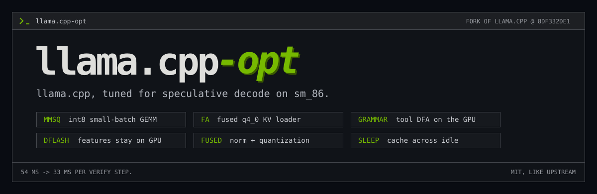

<p align="center">
  
</p>

<p align="center">
  <strong>A llama.cpp fork that verifies 8 draft tokens in 33 ms instead of 54.</strong><br>
  Qwen3.8-27B + DFlash2 speculative decoding on one RTX 3090, same output as before every kernel change.
</p>

<p align="center">
  <code>BASED ON 8DF332DE1</code> &nbsp; <code>CUDA / SM_86</code> &nbsp; <code>OPT-IN FEATURES</code> &nbsp; <a href="LICENSE">MIT</a>
</p>

<p align="center">
  <a href="#whats-different">What's different</a> &middot; <a href="#build">Build</a> &middot; <a href="#switches">Switches</a> &middot; <a href="https://github.com/invaliddayta/llm-opt">Benchmarks and notes</a> &middot; <a href="https://github.com/ggml-org/llama.cpp">Upstream llama.cpp</a>
</p>

This is [llama.cpp](https://github.com/ggml-org/llama.cpp) at upstream `8df332de1` (tag
`upstream-base`) plus a short, linear series of commits on `opt/main`. They target one setup:
a 27B hybrid Gated-DeltaNet/attention model (Qwen3.8-27B, IQ4_XS) drafting with DFlash2 on an
RTX 3090, verifying 8 tokens per step at long context. On that setup a verify step drops from
~54 ms to ~33 ms.

Everything else is upstream llama.cpp. Its documentation lives in [docs/](docs/), with
[build instructions](docs/build.md) and the [server README](tools/server/README.md).
Benchmarks, kernel labs and design notes are in
**[llm-opt](https://github.com/invaliddayta/llm-opt)**.

## What's different

| | Change | Effect |
| --- | --- | --- |
| **MMSQ** | Small-batch (N <= 16) quantized GEMM on int8 tensor cores for IQ4_XS, Q4_K, Q5_K, Q6_K: split-K, activation reuse, occupancy-aware dispatch | Weights stream at 750-830 GB/s of ~840; most of the speedup |
| **Fused norm** | Residual add + RMS norm + weight + MMSQ activation quantization as one kernel | 127 fewer kernels per step, bit-exact |
| **Q4 MMA attention** | q4_0 K/V decoded straight into the 8-query MMA flash-attention tiles | 95.8 -> 109.7 tok/s at 91K context |
| **GPU grammar** | Tool-call grammars compiled to a DFA, masked and sampled on the GPU (Philox RNG) | No logits copy to the host on tool requests |
| **DFlash features** | Target features for the DFlash2 draft stay in a CUDA staging tensor | No host round trip per step |
| **Small kernels** | Small top-k, conv-state snapshot fusion, small F32 matmul | Fewer, cheaper launches |
| **Sleep cache** | Server snapshots KV and recurrent state to disk on idle unload and restores it on wake | Long contexts survive idle sleep |
| **Race fix** | Write-after-read race on `KQ` in `flash_attn_ext_vec` (also in upstream) | racecheck 2.2M hazards -> 0 |

GPU sampling falls back to standard sampling for any request it can't serve (penalties,
logprobs, reasoning budget, regex triggers), so no request is rejected.

## Build

```sh
git clone -b opt/main https://github.com/invaliddayta/llama.cpp-opt && cd llama.cpp-opt
cmake -S . -B build -G Ninja -DGGML_CUDA=ON -DCMAKE_CUDA_ARCHITECTURES=86 -DCMAKE_BUILD_TYPE=Release \
      -DGGML_CUDA_FA_QUANTS="q4_0-q4_0;q8_0-q8_0;f16-f16;bf16-bf16"
ninja -C build llama-server
```

Example server for the target setup:

```sh
GGML_CUDA_FATTN_Q4_MMA=1 LLAMA_GPU_SAMPLING=1 LLAMA_DFLASH_GPU_FEATURES=1 \
build/bin/llama-server -m target-IQ4_XS.gguf --ctx-size 98304 --gpu-layers 999 --flash-attn on \
  --cache-type-k q4_0 --cache-type-v q4_0 \
  --spec-draft-model DFlash2-Q4_K_M.gguf --spec-type draft-dflash --spec-draft-ngl 999 \
  --spec-draft-n-max 7 --spec-draft-p-min 0 --backend-sampling --jinja
```

The full flag set used in benchmarks is in
[llm-opt `bench/serve_test.sh`](https://github.com/invaliddayta/llm-opt/blob/main/bench/serve_test.sh).

## Switches

| Env var | Default | Effect |
| --- | --- | --- |
| `GGML_CUDA_FATTN_Q4_MMA=1` | off | Fused q4_0 KV loader in MMA flash attention (sm86, head 256, 24/4 heads, 8 queries) |
| `LLAMA_GPU_SAMPLING=1` | off | Sampling and tool grammar on the GPU, per-request fallback |
| `LLAMA_DFLASH_GPU_FEATURES=1` | off | DFlash target features stay on the GPU |
| `GGML_CUDA_MMSQ=0` | on | Turns MMSQ (and its fusions) off |
| `GGML_CUDA_MMSQ_FUSE_NORM=0` | on | Turns only the fused norm/quantization off |
| `LLAMA_SLEEP_CACHE_DIR` | unset | Sleep cache: with `--sleep-idle-seconds N`, slots are written here on sleep and restored on wake |
| `LLAMA_SLEEP_CACHE_KEY` | required with DIR | Cache identity; change it whenever model, build or settings change |
| `LLAMA_SLEEP_CACHE_MAX_MIB` | 16384 | Size limit of the snapshot |

MMSQ needs Ampere or newer. Shapes, types and batch sizes outside its range use upstream's
kernels, and every opt-in leaves the upstream path untouched when off.

## Staying close to upstream

`opt/main` is a linear series on top of `upstream-base`. The whole difference as one patch:

```sh
git diff upstream-base opt/main -- . ':!examples' ':!README.md' ':!media/llama-cpp-opt.svg'
```

`examples/dflash-dump` holds fork-only tools for draft-model training and is left out.

## License

MIT, like upstream llama.cpp ([LICENSE](LICENSE)). Not affiliated with ggml-org.
